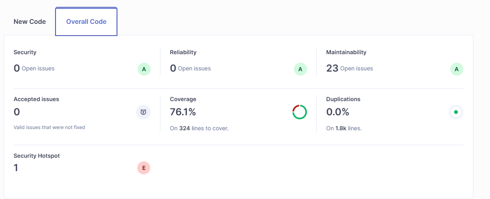
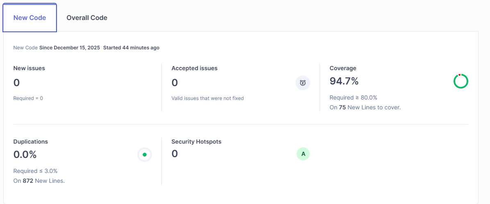

## Project Overview

**Gestão de Vagas** is a Spring Boot 3.5+ job management system built with Java 21. The application manages two primary entities: Companies (who post jobs) and Candidates (who apply for jobs), each with separate authentication flows using JWT tokens.

## Common Commands

### Build & Run
```powershell
# Build the project
.\mvnw.cmd clean install

# Run the application
.\mvnw.cmd spring-boot:run

# Run with specific profile
.\mvnw.cmd spring-boot:run -Dspring-boot.run.arguments=--spring.profiles.active=dev
```

### Testing
```powershell
# Run all tests
.\mvnw.cmd test

# Run specific test class
.\mvnw.cmd test -Dtest=GestaoVagasApplicationTests

# Run tests with coverage
.\mvnw.cmd test jacoco:report
```

### Package
```powershell
# Create executable JAR
.\mvnw.cmd package

# Skip tests during packaging
.\mvnw.cmd package -DskipTests
```

## Architecture

### Module-Based Structure

The codebase follows a **modular Clean Architecture** pattern with two main business modules:

- **`modules/candidate/`** - Candidate registration, authentication, and profile management
- **`modules/company/`** - Company registration, authentication, and job posting

Each module follows this structure:
- **`controllers/`** - REST endpoints (expose HTTP API)
- **`entities/`** - JPA entities (database models)
- **`dto/`** - Data Transfer Objects (request/response payloads)
- **`useCases/`** - Business logic (one class per use case)
- **`repository/` or `repositories/`** - JPA repositories (database access)

### Cross-Cutting Concerns

- **`config/`** - Application configuration (Swagger, etc.)
- **`security/`** - Spring Security configuration and filters
- **`providers/`** - JWT token validation services
- **`exceptions/`** - Global exception handling with `@ControllerAdvice`

### Key Architectural Patterns

1. **Use Case Pattern**: Each business operation is encapsulated in a separate `@Service` class (e.g., `CreateCandidateUseCase`, `AuthCompanyUseCase`)

2. **Dual Authentication System**: 
   - Companies use `SecurityFilter` with `JwtProvider` (secret: `security.token.secret`)
   - Candidates use `SecurityCandidateFilter` with `JWTCandidateProvider` (secret: `security.token.secret.candidate`)
   - Both filters are applied before `BasicAuthenticationFilter` in the security chain

3. **Entity Relationships**:
   - `JobEntity` has `@ManyToOne` relationship with `CompanyEntity`
   - UUIDs are used as primary keys for all entities
   - Timestamps are managed with `@CreationTimestamp`

4. **Exception Handling**:
   - Custom exceptions: `UserFoundException`, `EmailFoundException`
   - Global validation error handling via `ExceptionHandlerGlobal`
   - Use cases throw domain-specific exceptions caught by controllers

## Database Configuration

PostgreSQL database connection (see `application.properties`):
- **URL**: `jdbc:postgresql://localhost:5433/gestao_vagas_db`
- **Username**: `postgres`
- **Password**: `postgres`
- **DDL Strategy**: `update` (auto-creates/updates schema)
- **SQL Logging**: Enabled with formatting

When making database changes, Hibernate will auto-update the schema. For production, consider using Flyway or Liquibase migrations.

## API Documentation

Swagger UI is configured and available at:
- **Swagger UI**: `http://localhost:8080/swagger-ui.html`
- **OpenAPI JSON**: `http://localhost:8080/v3/api-docs`

All entities use `@Schema` annotations for API documentation. JWT authentication is configured in Swagger with bearer token support.

## Security & Authentication

### JWT Token Flow

1. **Company Authentication**:
   - POST `/company/` with username/password
   - Returns JWT token valid for 2 hours
   - Token issuer: "javagas"
   - Role claim: `["company"]`

2. **Candidate Authentication**:
   - POST `/candidate/` with username/password
   - Returns JWT token valid for 2 hours
   - Token issuer: "javagas"
   - Role claim: `["candidate"]`

### Protected Routes

All routes require authentication **except**:
- `/candidate/` (POST - registration)
- `/company/` (POST - registration)
- Swagger endpoints (`/swagger-ui/**`, `/v3/api-docs/**`)

### Adding New Authenticated Endpoints

When creating new protected endpoints:
1. Extract user ID from request attributes:
   - For candidates: `request.getAttribute("candidate_id")`
   - For companies: `request.getAttribute("company_id")`
2. These attributes are set by security filters after token validation

## Code Conventions

- **Lombok**: Used extensively (`@Data`, `@Builder`, `@AllArgsConstructor`, etc.)
- **Validation**: Jakarta Bean Validation on entities (`@Email`, `@Pattern`, `@Length`)
- **Password Encoding**: BCrypt via Spring Security's `PasswordEncoder`
- **Error Responses**: Controllers return `ResponseEntity<Object>` with try-catch for flexibility
- **Repository Method Naming**: Follow Spring Data conventions (e.g., `findByUsername`, `findByEmail`)

## Common Development Patterns

### Adding a New Use Case

1. Create `@Service` class in appropriate module's `useCases/` directory
2. Inject required repositories and services via `@Autowired`
3. Implement `execute()` method with business logic
4. Throw custom exceptions for error conditions
5. Wire into controller

### Adding a New Entity

1. Create entity class with `@Entity` and `@Data` (Lombok)
2. Use `@GeneratedValue(strategy = GenerationType.UUID)` for ID
3. Add `@CreationTimestamp` for automatic timestamps
4. Include `@Schema` annotations for Swagger documentation
5. Create corresponding repository interface extending `JpaRepository`

### Adding a New DTO

1. Use Java records for immutable DTOs (e.g., `AuthRequestCandidateDTO`)
2. Use `@Builder` pattern for complex response DTOs
3. Add `@Schema` annotations for API documentation

## Environment-Specific Notes

- **Windows Development**: This project is developed on Windows with PowerShell
- **Maven Wrapper**: Use `.\mvnw.cmd` instead of `mvn` for consistent Maven version
- **IDE**: IntelliJ IDEA configuration present (`.idea/` directory)

## Sonar

```powershell
docker run -d --name sonarqube -e SONAR_ES_BOOTSTRAP_CHECKS_DISABLE=true -p 9000:9000 sonarqube:community

mvn clean verify org.sonarsource.scanner.maven:sonar-maven-plugin:sonar "-Dsonar.projectKey=gestao_vagas" "-Dsonar.projectName=gestao_vagas" "-Dsonar.host.url=http://localhost:9000" "-Dsonar.token=sqp_15bd005543db50509949c79b09a7b73a4293785b"
```

## Prometheus Grafana

```powershell
docker-compose -f docker-compose-monitoring.yml up -d
```
